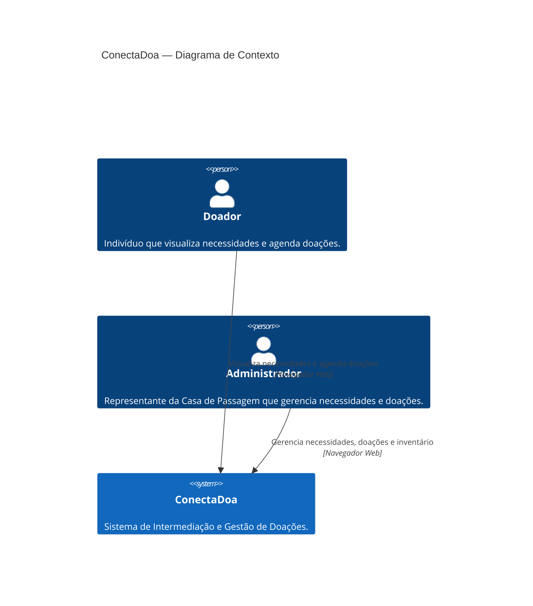
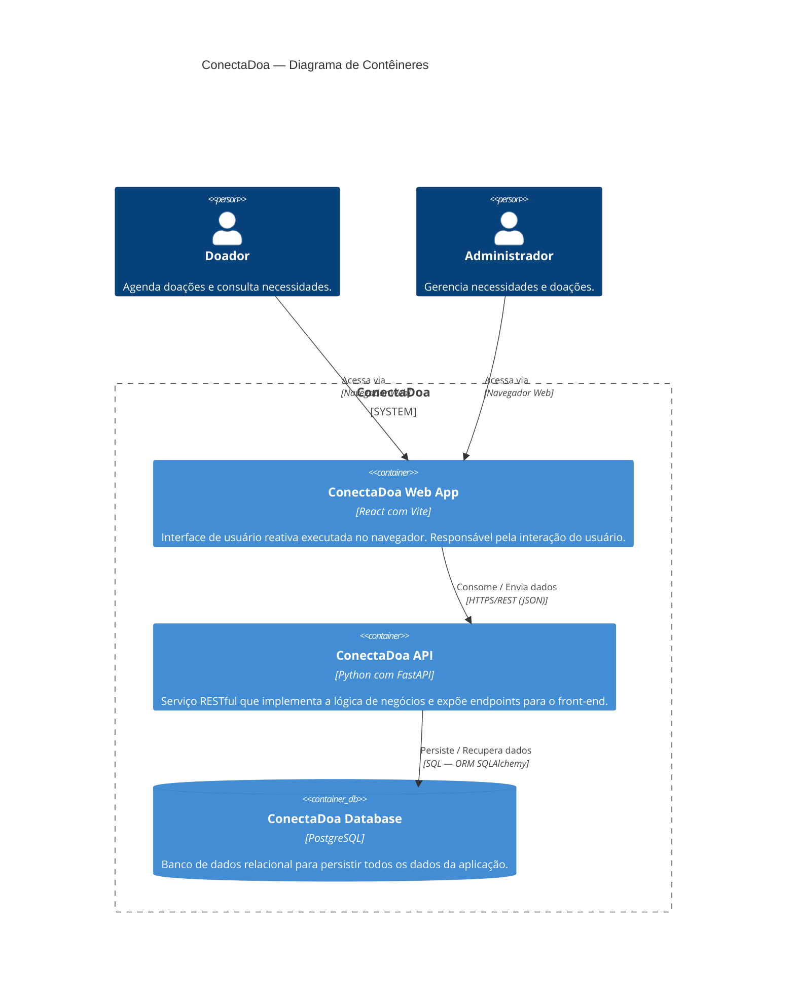
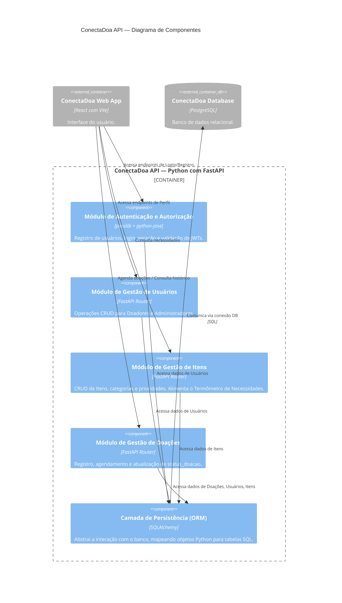
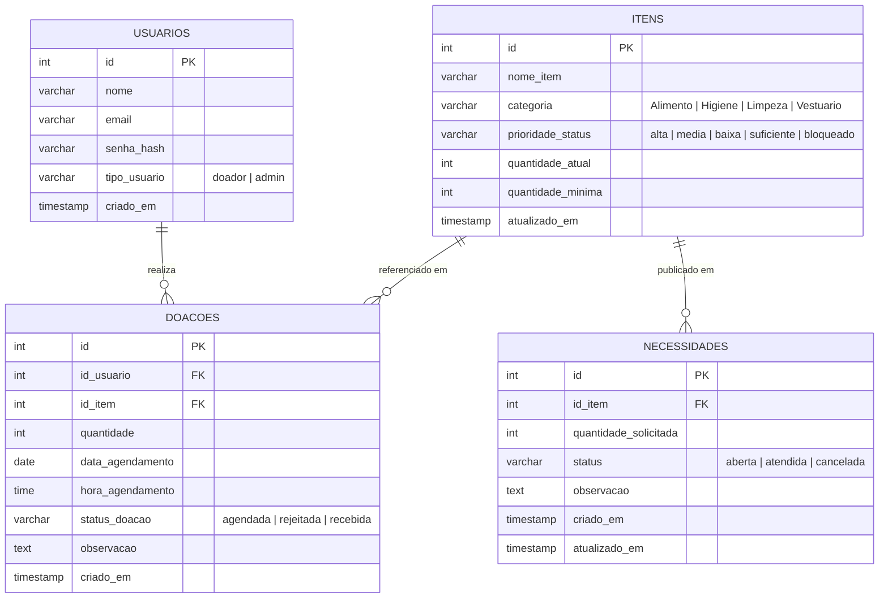

# Documento de Arquitetura do Sistema ConectaDoa

> **Repositório:** `conectadoa-docs`  
> **Versão:** 1.0  
> **Modelo de diagramação:** C4 Model (Contexto, Contêineres, Componentes) + DER

---

## Sumário

1. [Visão Geral](#1-visão-geral)
2. [Diagrama de Contexto — C4 Nível 1](#2-diagrama-de-contexto--c4-nível-1)
3. [Diagrama de Contêineres — C4 Nível 2](#3-diagrama-de-contêineres--c4-nível-2)
4. [Diagrama de Componentes — C4 Nível 3](#4-diagrama-de-componentes--c4-nível-3)
5. [Diagrama Entidade-Relacionamento (DER)](#5-diagrama-entidade-relacionamento-der)
6. [Decisões de Design](#6-decisões-de-design)

---

## 1. Visão Geral

O **ConectaDoa** é um sistema de intermediação e gestão de doações, desenvolvido para conectar doadores à Casa de Passagem Geisiane Valente. A plataforma permite que doadores visualizem as necessidades da instituição e agendem suas doações, enquanto os administradores gerenciam o inventário e acompanham o status de cada contribuição.

**Stack tecnológica:**

| Camada | Tecnologia |
|--------|-----------|
| Front-end | React com Vite |
| Back-end (API) | Python com FastAPI |
| Banco de dados | PostgreSQL |
| ORM | SQLAlchemy |
| Autenticação | JWT (`passlib` + `python-jose`) |

---

## 2. Diagrama de Contexto — C4 Nível 1

Apresenta o sistema ConectaDoa e suas interações com os atores externos. Este é o nível mais alto de abstração.

**Atores e responsabilidades:**

- **Doador** — acessa a plataforma para consultar o "Termômetro de Necessidades" e agendar uma doação de item específico com data e horário.
- **Administrador da Casa de Passagem** — gerencia o cadastro de itens necessários, aprova ou rejeita doações agendadas e atualiza o status do inventário.

---

## 3. Diagrama de Contêineres — C4 Nível 2

Detalha os contêineres (aplicações e serviços) que compõem o sistema e como eles se comunicam.

**Detalhamento dos contêineres:**

| Contêiner | Tipo | Tecnologia | Responsabilidade |
|-----------|------|-----------|-----------------|
| `ConectaDoa Web App` | Web Application | React + Vite | Interface reativa; renderiza o Termômetro de Necessidades, formulários de agendamento e painel administrativo. |
| `ConectaDoa API` | API / Serviço | Python + FastAPI | Lógica de negócios; valida autenticação JWT; expõe endpoints REST para todas as operações do sistema. |
| `ConectaDoa Database` | Database | PostgreSQL | Persistência relacional de usuários, itens e doações. |

---

## 4. Diagrama de Componentes — C4 Nível 3

Expande o interior da **ConectaDoa API**, mostrando seus principais módulos lógicos e dependências internas.

**Detalhamento dos componentes:**

| Componente | Bibliotecas | Responsabilidade principal |
|------------|------------|---------------------------|
| Autenticação e Autorização | `passlib`, `python-jose` | Hash de senhas (bcrypt), emissão e validação de tokens JWT. |
| Gestão de Usuários | FastAPI Router | CRUD completo para `tipo_usuario` = `'doador'` e `'admin'`. |
| Gestão de Itens | FastAPI Router | Gerencia `categoria` e `prioridade_status`; dados que alimentam o Termômetro de Necessidades. |
| Gestão de Doações | FastAPI Router | Controla o ciclo de vida da doação: `agendada → aprovada → recebida` (ou `rejeitada`). |
| Camada de Persistência (ORM) | SQLAlchemy | Único ponto de acesso ao banco; define os modelos relacionais e gerencia sessões. |

---

## 5. Diagrama Entidade-Relacionamento (DER)

Representa a estrutura lógica do banco de dados PostgreSQL, com entidades, atributos e cardinalidades.

**Regras de negócio refletidas no schema:**

- Um `USUARIO` pode ter zero ou muitas `DOACOES` (1:N).
- Um `ITEM` pode estar associado a zero ou muitas `DOACOES` (1:N).
- O campo `status_doacao` controla o ciclo de vida completo da doação e é atualizado pelo Administrador.
- O campo `prioridade_status` em `ITENS` alimenta o Termômetro de Necessidades exibido para os doadores.
- `email` possui restrição `UNIQUE` para evitar cadastros duplicados.

---

## 6. Decisões de Design

| Decisão | Justificativa |
|---------|--------------|
| Separação front-end / back-end (SPA + API REST) | Permite evolução independente de cada camada e facilita o reuso da API em futuros clientes (ex: app mobile). |
| FastAPI como framework de API | Geração automática de documentação OpenAPI (`/docs`), validação via Pydantic e alta performance assíncrona. |
| SQLAlchemy como ORM | Abstração portável do banco, suporte a migrações via Alembic e type safety nos modelos. |
| Autenticação via JWT | Stateless — elimina a necessidade de sessões no servidor, simplificando o escalonamento horizontal. |
| PostgreSQL | Banco relacional robusto com suporte a transações ACID, adequado para o relacionamento entre usuários, itens e doações. |
